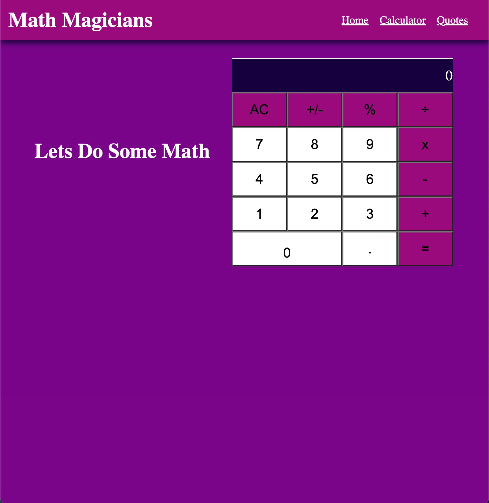
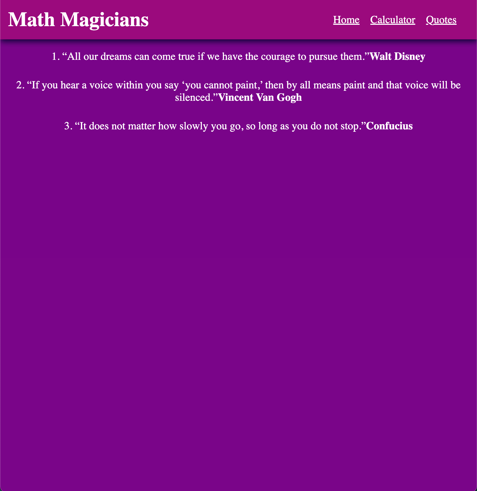

# Math magicians app
This is a single page application that includes three pages; Home, Calculator and Quotes. You can do Math Calculations and read quotes.

# Built with
- React.js
- HTML
- CSS
# Other tools
- Babel compiler

## Live Demo

For the link to the live demo, [Heroku](https://math-magicians-129.herokuapp.com/)
[Netlify](https://math-magician-129.netlify.app/)

# Getting Started with Create React App
This project was bootstrapped with [Create React App](https://github.com/facebook/create-react-app).

## installation
In order to run on your local machine, type in;

- `npx create-react-app my-app`
- `cd my-app`
- `npm start`

Runs the app in the development mode.

# Author
:bust_in_silhouette: **Author 1: Acholah Lynette**
- GitHub: [@iLynette](https://github.com/iLynette)
- Twitter: [@acholah_lynette](https://twitter.com/acholah_lynette)
- LinkedIn: [acholah lynette](https://www.linkedin.com/in/lynette-acholah/)

## :handshake: Contributing
Contributions, issues, and feature requests are welcome!
## Show your support
Give a :star:️ if you like this project!
## Acknowledgments

Math magicians app
Web site created using create-react-app